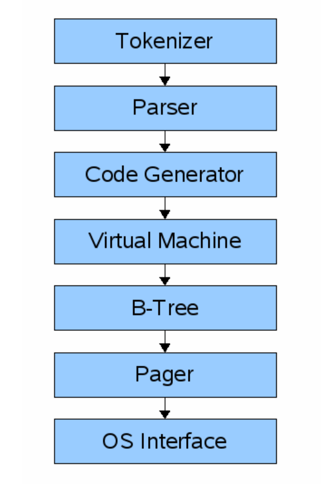
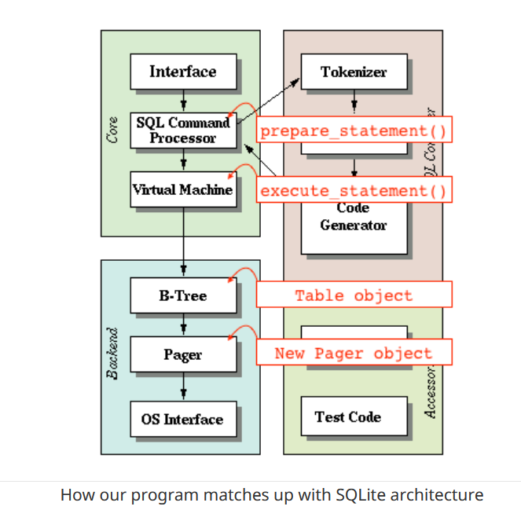

# sqlite
A sqlite clone

A step by step implementation of a dummy sqlite
Reference: https://cstack.github.io/db_tutorial/

Frontend:-
- Tokenizer
- Parser
- Code generator

SQL Query -> Frontend -> Sqlite virtual machine bytecode (compiled program that can operate on the database)

Backend:-
- Virtual machine
- B-Tree
- Pager
- OS Interface

Virtual Machine - Takes bytecode from frontend as instructions. Performs operations on tables or indexes, stored in a B-Tree. Essentially a big switch statement on the type of bytecode instruction.

B-Tree - Many nodes. Each node is one page in length. Can retrieve a page from disk or save it back on disk by issuing commands to pager

Pager - Recieves commands to read/write pages of data. Responsible for reading/writing at appropriate offsets in the database file. Also maintains a cache, and determines when to delete pages or write back on disk

OS Interface - Depends on the OS sqlite was compiled for.

SQLite Architecture- 

Advantages of decoupling into frontend and backend-
- Reduced complexity (Virtual Machine does not worry about syntax errors)
- Allows compiling common queries once and caching the bytecode

To get started-
    Store rows in blocks of memory called pages
    Each page stores as many rows as it can fit
    Rows are serialized into a compact representation with each page
    Pages are only allocated as needed
    Keep a fixed-size array of pointers to pages

Adding persistence-
    Write the blocks of pages into a file
    Read them back into memory the next time program is loaded
    Creating an abstraction, pager
    We ask it the page number x, it gives us a block of memory
    First look in its cache, if miss copies data from disk into memory (by reading the database file)
        - Save the entire database into a file
        - Already serialized row sinto page-sized memory blocks.
        - For persistence, we can simply write those blocks of memory to a file
        - Read them back into memory the next time the program starts up

